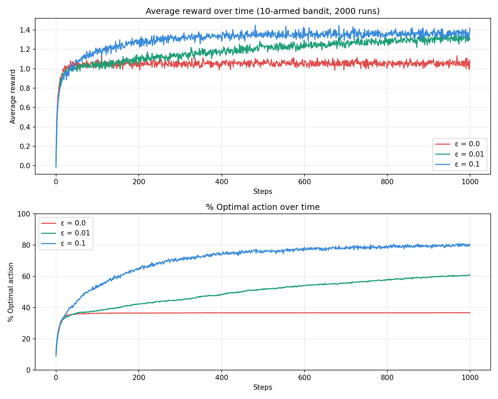

# RL n-Armed Bandit

Epsilon-greedy agent from scratch — reproduces Figure 2.1 from 
Sutton & Barto's *Reinforcement Learning: An Introduction* (2nd ed.)

## What it does
- Implements the n-armed bandit problem with 10 arms
- Compares ε = 0, 0.01, and 0.1 strategies over 2000 runs
- Shows why exploration matters for long-term reward

## Results

## How to run
pip install numpy matplotlib
python bandit.py

## Reference
Sutton & Barto, Reinforcement Learning: An Introduction, Chapter 2
